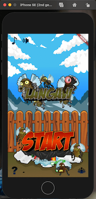
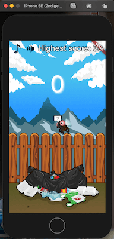

# langaw

> 基于 Flutter 和 Flame 实现的"拍苍蝇"小游戏

## 背景

学习 Flutter 的练习项目，该项目的核心逻辑和素材出自`awesome-flame项目中Alekhin的初学者教程系列`

## 改进

1. 增加资源加载的引导页
2. 升级Flame版本到0.29.3，并解决api不适配问题
3. 适配Flutter2.0
4. 改进玩法，击落不同类型的"苍蝇"得分不同

## 玩法

游戏会随机生成飞行速度不同的苍蝇，同屏最多5只。每只苍蝇拥有独立的倒计时，在倒计时结束前击落累计得分。否则，游戏结束。

## 预览

